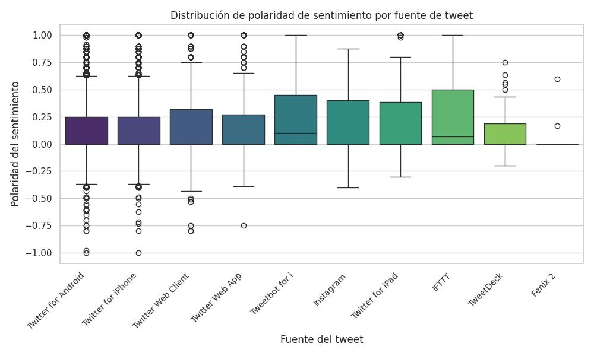
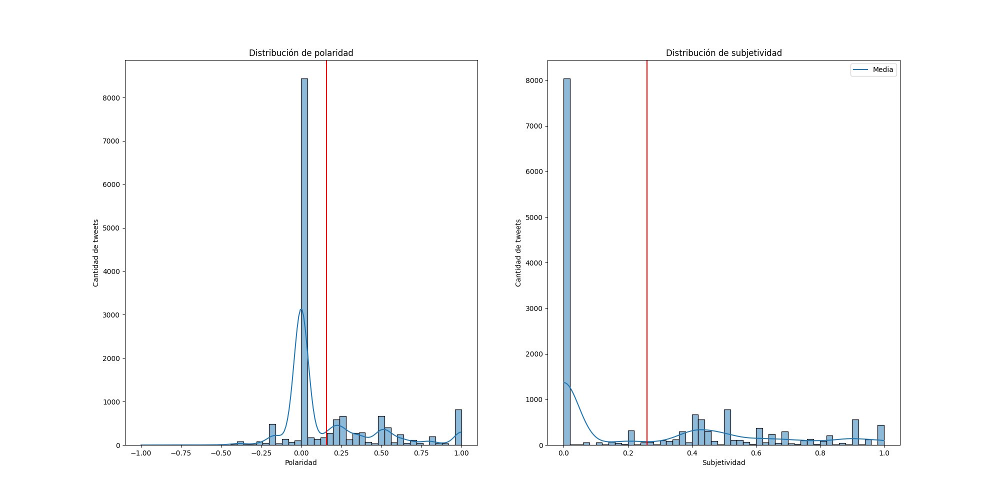
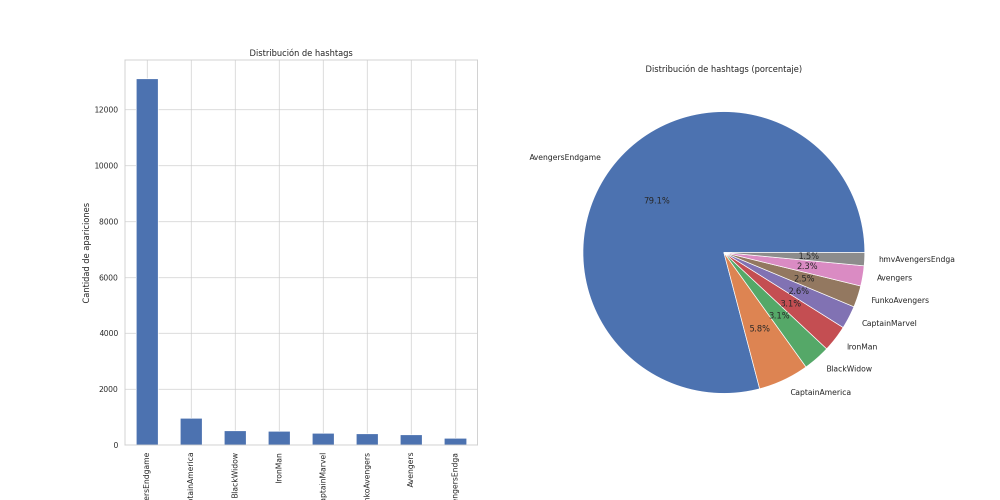
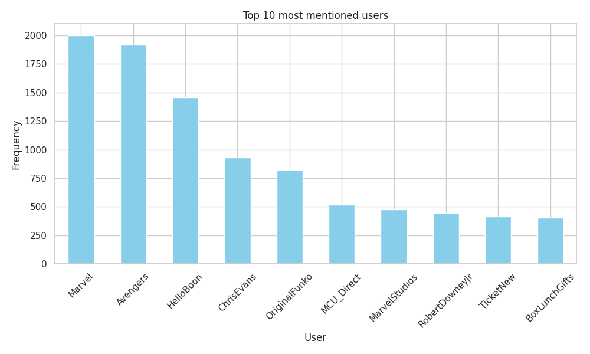
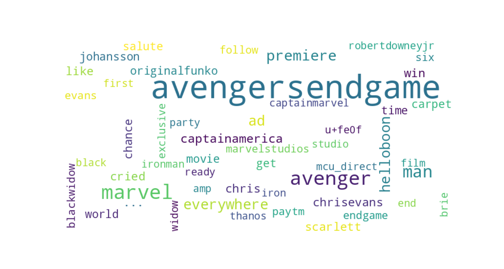

## Análisis

### POLARIDAD EN FUNCIÓN DEL SOURCE

El eje X muestra las distintas fuentes de origen del tweet.
El eje Y muestra la polaridad, la cual varía de -1 (sentimiento muy negativo) a 1 (sentimiento muy positivo), siendo 0 el punto neutro.

La mayoría de las fuentes de los tweets muestran una mediana de polaridad cercana a 0 y levemente positiva, lo que indica una tendencia general hacia el punto neutro y un leve sentimiento positivo en los tweets.

Las plataformas como Twitter for Android y Twitter for iPhone presentan una distribución amplia con bastantes valores atípicos tanto en el extremo positivo como negativo, lo que indica diversidad en las opiniones de los usuarios de estas plataformas.

Otras fuentes, como TweetDeck y Fenix 2 , muestran una menor dispersión de la polaridad y una mediana ligeramente mas baja lo que podría significar una tendencia hacia sentimientos más neutrales o levemente negativos desde estas fuentes.

Instagram y Twitter for iPad presentan una mayor dispersión hacia el extremo positivo, sugiriendo que los tweets desde estas plataformas suelen tener una polaridad más positiva.

En resumen podemos concluir con que las plataformas más utilizadas y famosas muestran una amplia variedad de polaridades con opiniones y sentimientos diversos

### DISTRIBUCIÓN DE LA POLARIDAD Y SUBJETIVIDAD

El eje X muestra la polaridad en la gráfica de la izquierda , situándolos en valores entre el -1 el cual seria una valoración negativa del sentimiento y el 1 la cual sería positiva.
El eje Y muestra la frecuencia o cantidad de los tweets con una polaridad especifica.

Analizando la distribución podemos observar que la mayoría de los tweets tienen una polaridad cercana a 0 indicando que una gran cantidad de ellos expresan un sentimiento neutral.

Hay picos más pequeños en polaridades positivas, especialmente alrededor de las franjas de 0.25 - 0.5 y 0.8 - 1.0, lo que sugiere que también hay un número considerable de tweets con un tono ligeramente positivo y muy positivo.
La cantidad de tweets con polaridad negativa es menor en comparación con los tweets neutrales y positivos, aunque también hay algunos valores en el rango de -0.25.
La gran concentración de tweets neutrales puede indicar una reacción moderada, mientras que el sesgo hacia valores positivos nos indica una tendencia general hacia la aceptación o agrado por la película, aunque no con muchas expresiones particularmente intensas

Del mismo modo, para la gráfica de la derecha la subjetividad está dada por un número flotante perteneciente al intervalo [0, 1] donde en la misma relación que la polaridad, entre más cercano al 0 es menos subjetivo que si está cerca al 1. Pensando en esto,
se nota que de manera general los tuits de la muestra son poco objetivos y son realmente pocos los que tienen mayor grado de subjetivida

### TOP 10 HASTAG MÁS UTILIZADOS

La primera imagen es un gráfico de barras que muestra los 10 hashtags más utilizados y la frecuencia que tienen en el conjunto de datos.
La segunda imagen es un gráfico de sectores que muestra entre los hashtags más mencionados cuál es su porcentaje de aparición.

Vemos como el hashtag AvengersEndgame es el que mayor número de veces aparece en el conjunto de datos con un total de más de 13000 menciones (lo que representa casi un 80% del porcentaje de los hashtags más utilizados). Esto sugiere que los usuarios estaban principalmente interesados en la película en general, más que en los personajes. Esto podría indicar un gran entusiasmo hacia el estreno de la película.

La aparición de personajes como el Capitán América, Iron Man, Black Widow o la Capitana Marvel entre los hashtags más mencionados podría indicarnos la importancia que tienen éstos dentro de la película.

Finalmente, la aparición de hashtags como FunkoAvengers o Avengers puede deberse a conversaciones entre fans que no sólo hablan de la película, sino de la saga completa de los vengadores.

### TOP 10 USUARIOS MÁS MENCIONADOS

Este gráfico de barras muestra los 10 usuarios más mencionados.
Marvel y Avengers encabezan la lista de menciones, con más de 1750 menciones cada una. Esto sugiere que la mayoría de los tweets se enfocan en las cuentas oficiales de la franquicia y el propio nombre de la película.

HelloBoon ocupa el tercer lugar, aunque con una frecuencia notablemente menor que los dos primeros. Puede ser una cuenta de influencer, fan destacado o creador de contenido que generó muchas interacciones.

Otros usuarios mencionados incluyen actores de la película como Chris Evans (Capitán América) y Robert Downey Jr (Iron Man), lo que refleja el interés de los fanáticos en los protagonistas principales.

La gran cantidad de menciones a cuentas oficiales y de actores principales indica una gran participación de los fans que desean interactuar con los perfiles más importantes de la empresa.

Las menciones a cuentas como TicketNew y BoxLunchGifts muestran interés en la compra de entradas y productos de Avengers, lo cual explica la expectativa que tuvo la película con una gran demanda de entradas y merchandising en el lanzamiento.

Este análisis muestra que el contenido de los tweets gira en torno a las cuentas oficiales de la película, los protagonistas, y también al merchandising y la compra de entradas, demostrando un gran interés y participación de los fanáticos en múltiples aspectos relacionados con la película.

### NUBE DE PALABRAS

Parte del algoritmo para la determinación del sentimiento en un texto dado, por la librería NLTK consiste en tokenizar el texto. La tokenización consiste en el preprocesamiento para descomponer el texto en palabras individuales o tokens. Esto ayuda a separar en palabras individuales un texto para facilitar su análisis y comprensión. Pensando en esto, fue de interés saber cuáles eran las palabras más utilizadas por la librería NLTK para determinar la polaridad de un texto.

Para esto se desarrolló la función preprocess_text(text), la cuál recibe como argumento el texto que conforma el tuit después de aplicar en él cierta limpieza que elimina caracteres o palabras que pueden confundir o disminuir la precisión en el cálculo de la polaridad (menciones, hashtags, URL, signos de puntuación, entre otros). En esta función se desarrolla paso a paso la tokenización para finalmente devolver un dato de tipo str que contiene el nuevo texto del tuit, ahora tokenizado.

Posteriormente en la función `python plot_most_used_token(df: pd.DataFrame, output_dir: str)` se hace un conteo de los tokens o palabras más repetidas entre todos los tuits y finalmente obtiene los más repetidos.

Esta gráfica fue pensada con el objetivo de analizar cuáles son las palabras que el algoritmo utilizó más para analizar la polaridad de los tuits.

De los resultado podemos observar que algunos de los tokens más repetidos también reflejan los temas de los que más se habló en los tuits: podemos encontrar que tokens como "avengersendgame", "marvel" o "avenger" fueron los más repetidos, lo cuál resulta obvio teniendo en cuenta el contexto en el cuál los tuits se obtuvieron; al mismo tiempo se notan ciertos gustos o las temas de discusión más tocados por la audiencia en tokens como "ironman", "captainamerica", "scarlett", "johansson", "chris", "evans", etc. Y finalmente observamos algunos tokens que evidentemente son claves para determinar un sentimiento como "cried", "party", "win" o "ready".

# Resultado

## Conclusión

Este análisis nos permite comprender mejor las reacciones de los usuarios de Twitter frente a Avengers Endgame, ofreciendo una visión general de las emociones y opiniones expresadas en esta plataforma.

Además, el análisis de hashtags y menciones proporciona información sobre los temas y personajes más discutidos en la conversación digital alrededor de la película.
